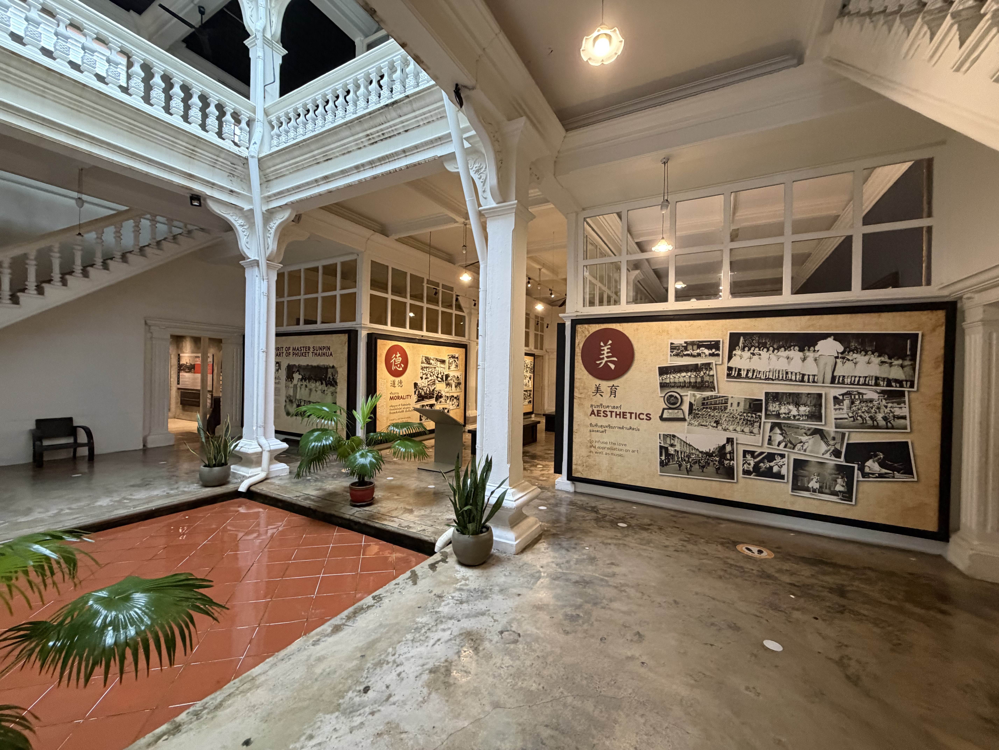
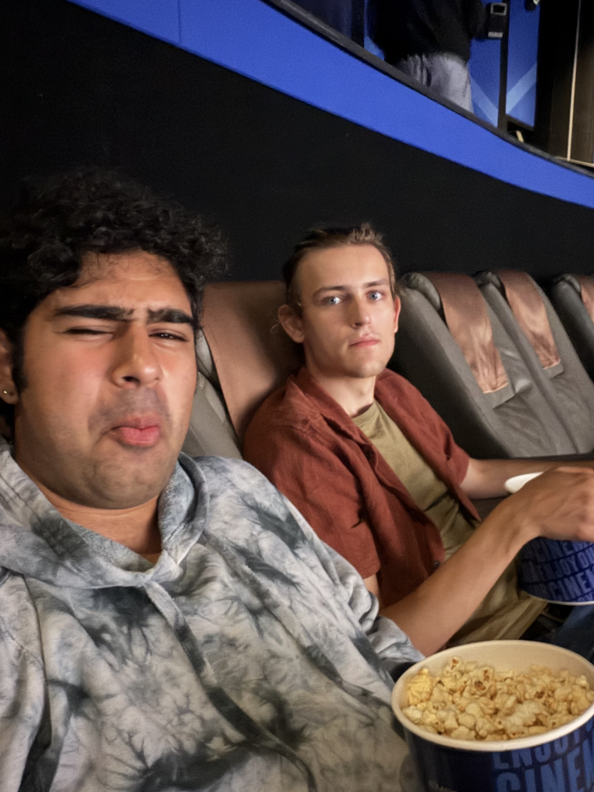
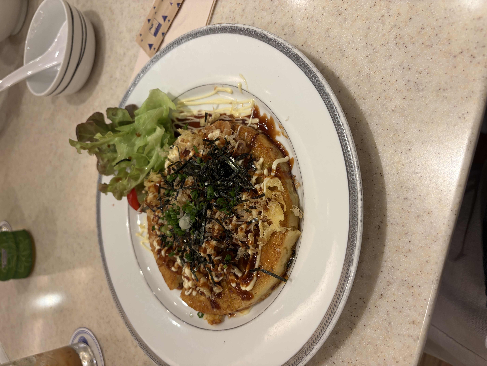
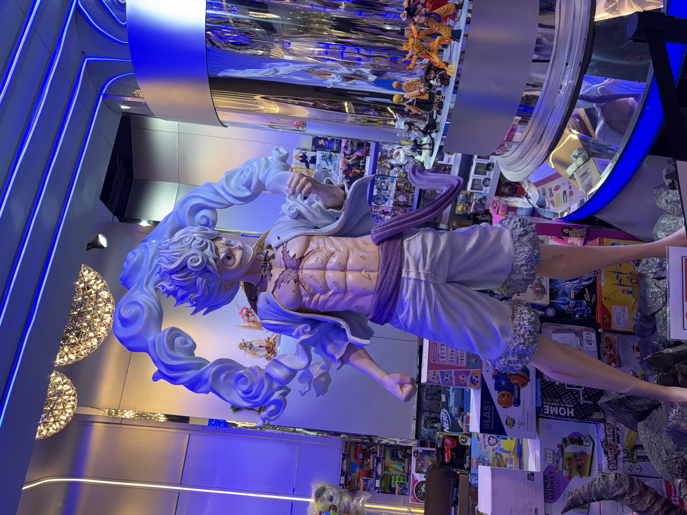
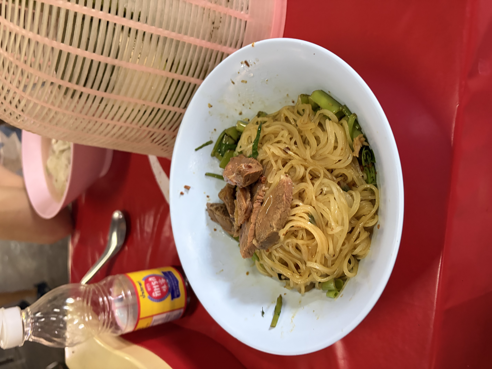
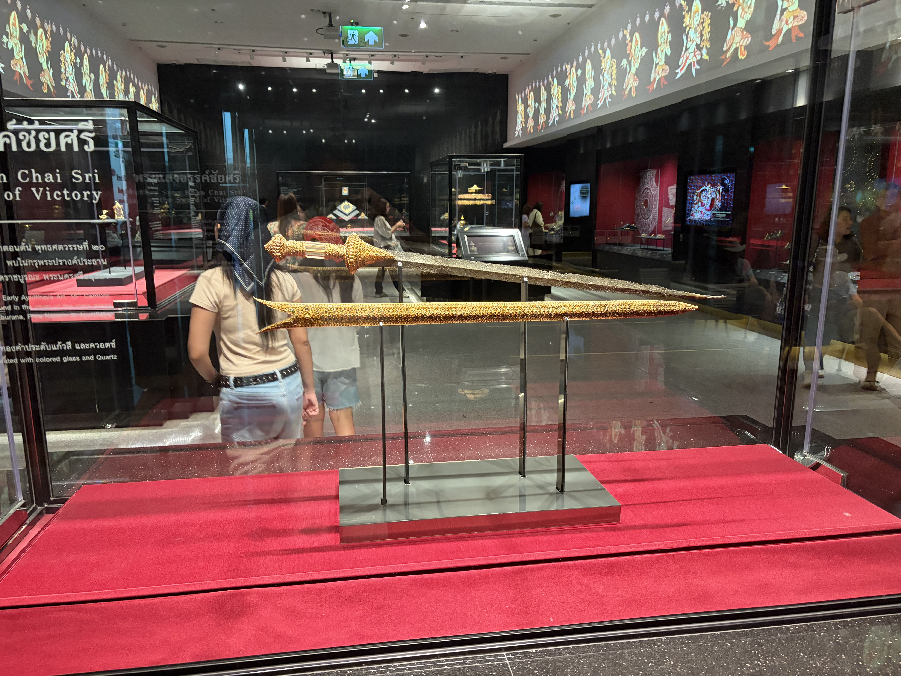
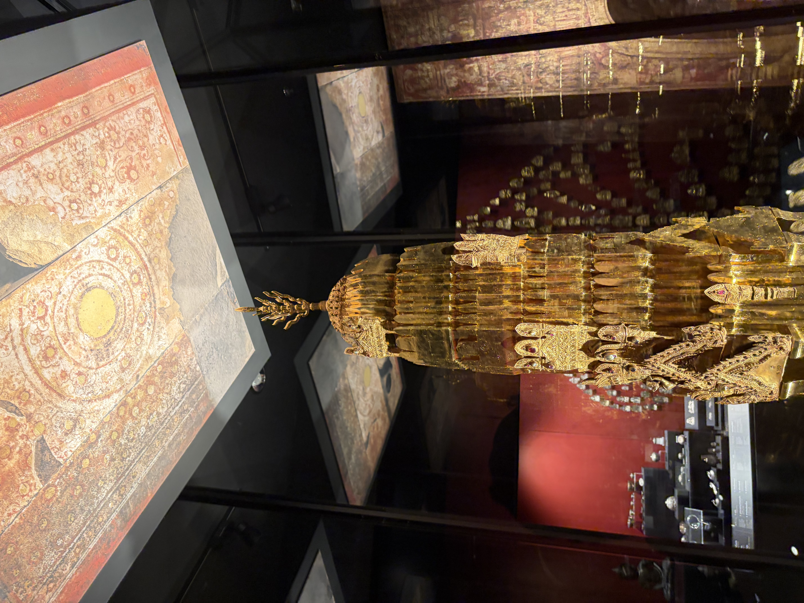
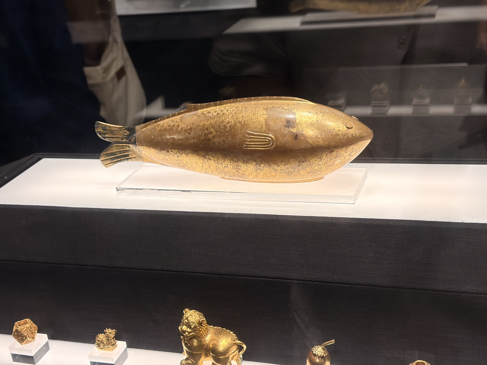
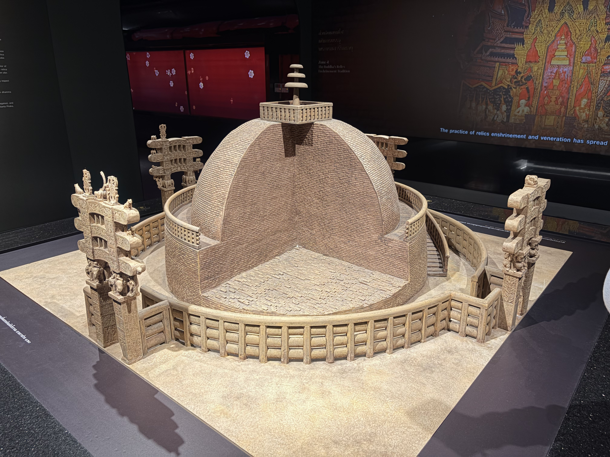

Hey yall! Been a little longer since a blog update, for context, yesterday in Phuket it rained, so there is a lot less to talk about(still did things, but less) so I decided to just halt and do double day post!

# Rainy Day Activities

So originally we planned to go to Freedom beach this day, but with torrential rain, it was not really possible, so we first went to a museum local to us. We stayed at Aekkeko Hostel(HEAVILY recommended), and it was just down the street, it was the Phuket Thai Hua museum. It discussed a lot of history of some historical buildings, but more specifically the history of that building and Chinese Immigration to Thailand and Phuket. The building used to be a school and it gave a lot of context for the journey in which this building took to get here.

\
The second big thing we did that day is we decided to go to the Theatre. At the time of writing, The Odyssey recently just came out, so we went to SFX Cinema at the Central Phuket Mall, and first of all the movie was a near perfect movie for me(I have like 1 or 2 critiques but this is a travel blog). Second, a note to all foreigners, a video in celebration of the king of thailand may play before your film, if that happens, just stand to be respectful until its done. The theatre was more comfortable than any theatre I have been in while living in the US and the tickets were about 10 dollars USD.

\
Afterwards, Benji and I explored the mall checking out a mega stationary store, clothing shops and getting dinner at a japanese place, i had a shrimp **okonomiyaki**(kind of japanese pancake with toppings). Overall simple day, we did end up going to bed early as tomorrow we were waking up at 4 am to start our journey to Ayutthaya.

# This Journey was exhausting

We checked out early that morning, and went to the Phuket Bus terminal, where there was express bus shuttles to the airport for only 100 baht each of us. We got on at about 5 am and got to the airport at 6am, we got checked in to our flight, and then set off in the air by 7 am. Landing by 9 am in Bangkok. From here, we got coffee to keep ourselves sane and then got on a train to Ayutthaya at 11 am(only tickets we could get were standing since we weren’t able to book in advance), and arrived in Ayutthaya by Noon. This took a lot out of us, but we didn't keep us down, we dropped off our bags at our hotel, then got lunch.

# Enjoying Ayutthaya

For lunch we went to a place called Uncle Leks and had some absolutely delicious noodle bowls(beef for me, pork for benji) as well as some fantas. All for under 200 baht. Amazing meal would recommend.

\
From there, we went to the Chao Sam Phraya National Museum, a museum made dedicated to the artifacts found in the archeological extractions in Ayutthaya in the 50s and 60s. The Museum gave us a lot of context for what we were going to see in the Historical park, the significance of some of the temples, how one was a tomb dedicated to the king in the 15th century, and the purpose of artifacts there. Here are a couple photos from the exhibit:

\
After we finished with the exhibit we explored the ruins for an hour before realizing we were drained. We didn’t feel too bad about leaving early as we have half a day tomorrow in Ayutthaya tomorrow before heading to Chiang Mai. 

After resting at the hotel for a bit, we eventually got dinner at the local night market that we were told about by the hostess of the hotel, and it was HUGE. Arguably one of the bigger ones we have been to here. One of the more affordable ones: for 110 baht I got a chicken terriyaki rice bowl, a black sesame soup milk, a lemon soda and a chocolate thai pancake. That is about 3 dollars USD. I am currently stuffed, and now back at the hotel both loving and regretting my decision

\
This blog post was a bit short and more crammed, it has been an exhausting 2 days, but none the less a lot of fun! Will have more adventures to share soon!

\
BRB,

Sharyq
