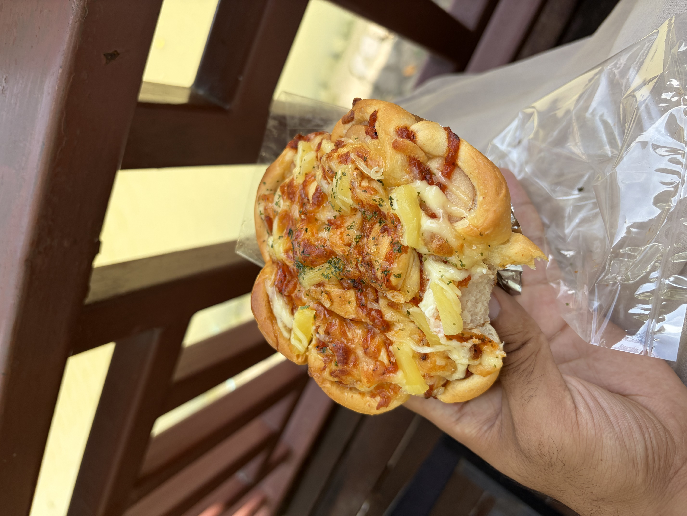
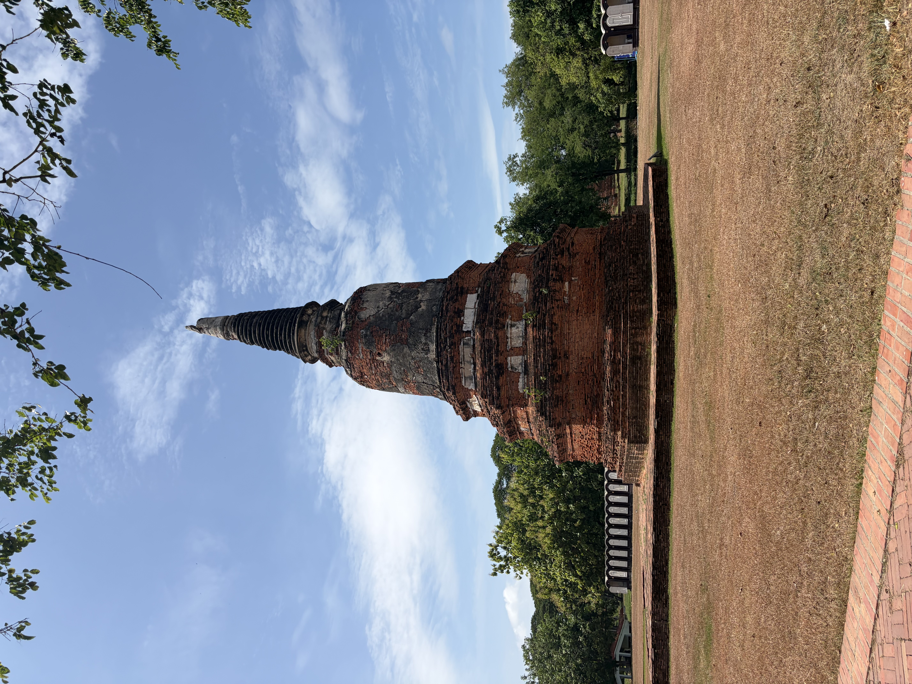
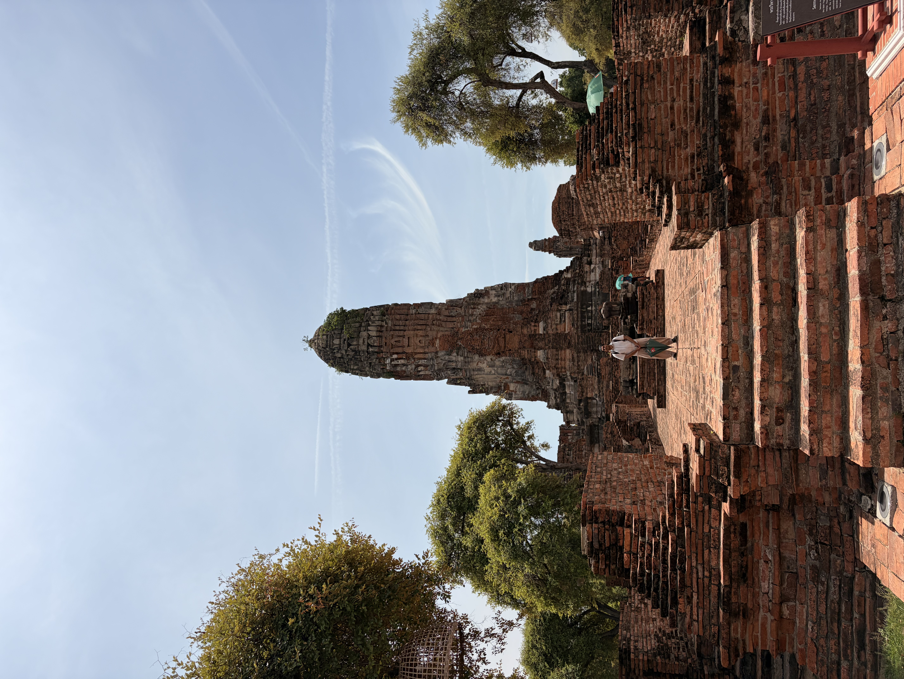
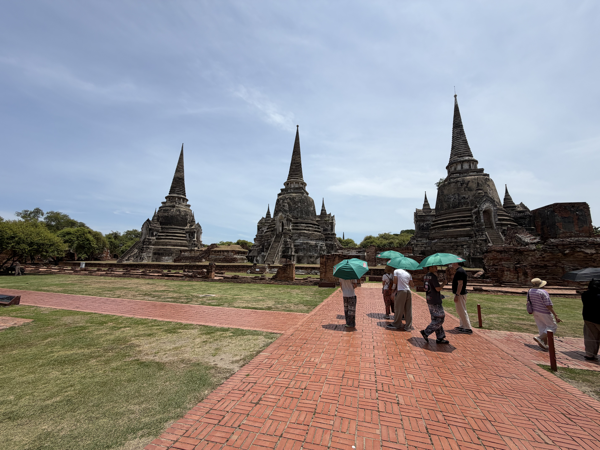
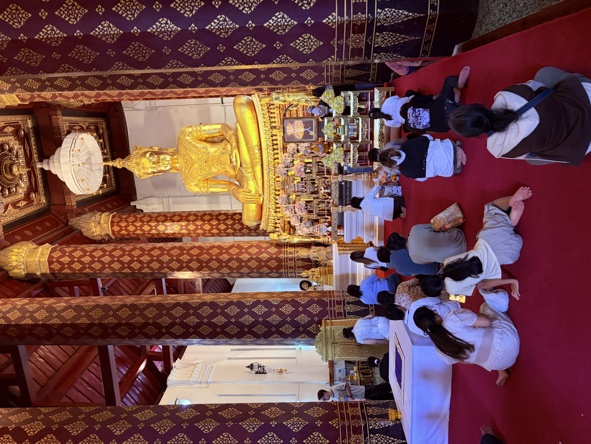
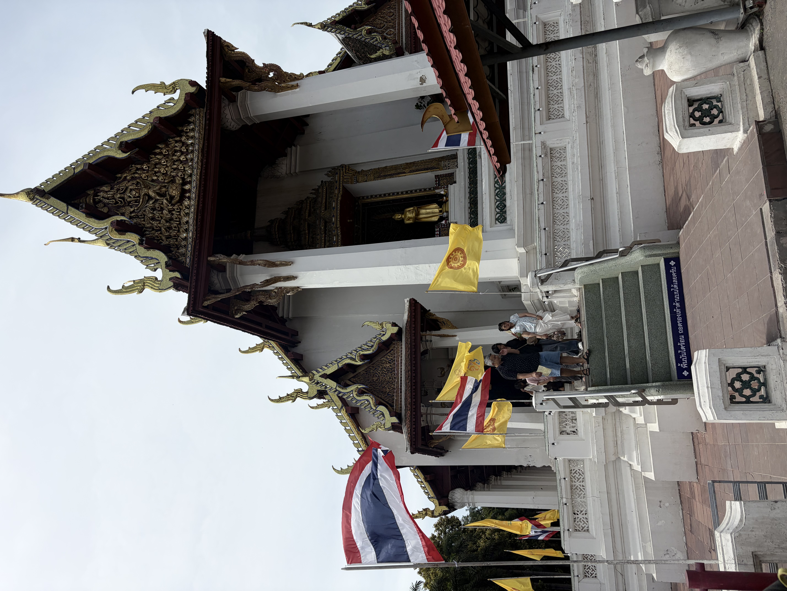
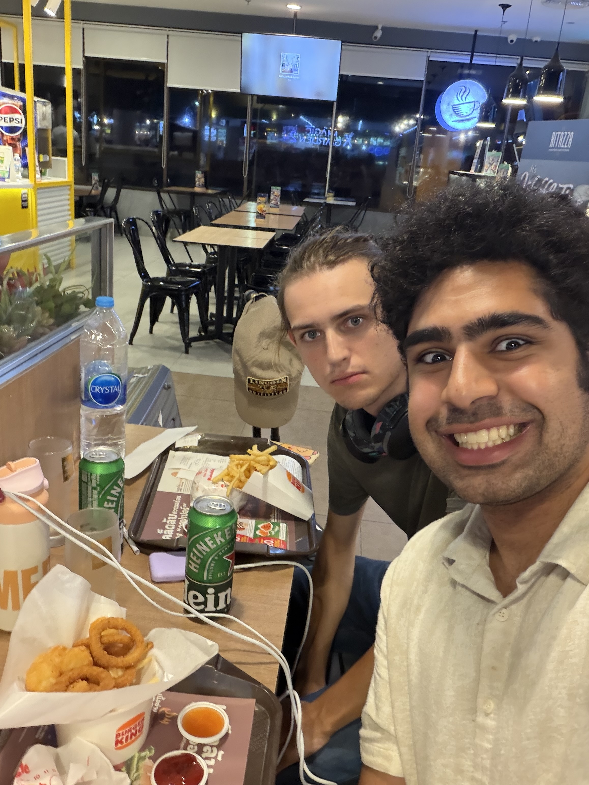
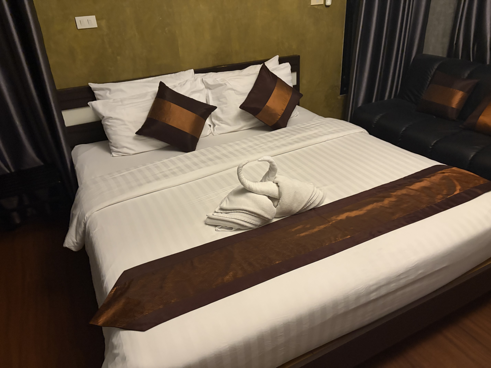

Hey y’all! Today was a lot, so posting a bit late again! Today we finished some more exploring of the Ayutthaya Historical Park primarily.

# Exploration of the Historical Park

We started off this morning by going to a cute local bakery called “Nana’s” down the street from our Hotel Roymen Cafe & Homestay. My meal was a chicken sausage and jam pastry and a cream cheese and spinach bun and they were delicious! Benji and I ate back at the terrace of our hotel where benji got a coffee there.

From there, we checked out and left our bags there, and then started our exploration. The historical park is huge so we are glad we dedicated as much time to it as possible. We started at the wast side first seeing Wat Langkhakhao.

From there we walked past the pond to Wat Phra Ram, our first major ruins of the day. For about 80 baht(~2 USD) you get to see most of the historical park. First seeing a 3d printed reconstruction of it, we got to explore outsides of the ruins. Many of the insides of temples were bot available to the public for safety reasons but it was gorgeous around here.

From there we walked a lil further west till we reached the 3 major temples, Wat Phra Si Sanphet. There was originally 6, but only the 3 large ones lasted the test of time. 

The walk around was a lot and very hot, we ended up taking a break to get boat noodles! Once again, noodle soups here are amazing. 

Afterwards, we walked around a tad more trying to find an entrance to the ancient palace, but every entrance was closed to the public, so we ended up going to one last Wat thats more popular among the locals: Wat Na Phra Men Rachikaram. It was very popular today, no idea why, but lots of people praying and we just got to take in the view.

# Travel Disaster

We started wrapping up here, Benji had scheduled us a 3:30pm train and a 5:20 pm flight. Theoretically the train was about to take 45 minutes to get to Don Mueng Airport(which has at max 5 minute security line). We were given an unfortunate surprise though, our train was delayed by an hour. Which essentially meant we werent making our plane. Benji and I from here went through the 5 stages of grief. First trying to believe we could actually make our plane, then anger when realize the train had failed us so badly. We tried to bargain with NokAir but there was nothing we could do, reached a state of depression as we realized we would have to book a flight at 9:30pm. Finally reaching acceptance as we ate Thai Burger King, drank a beer, and has a krispy kreme donut.

We spent about 4 hours in Don Mueng Airport, and due to the time and area we were in, there wasnt much we could do besides wait, so we just killed time there. Honestly this could have been a bad experience but benji and I just spent the entire time cracking jokes, walking around and taking it easy. While it was a defeating situation, there isn’t anyone better to be in this situation with(besides maybe Zendaya, she seems pretty fun to hangout with, but Benji is definitely a close second though). 

We boarded our plane, took naps, arrived in Chiang Mai, then checked into our hotel, where we realized I may have booked us a couples room. I just saw a good deal on the place only having it be 80 bucks USD for 5 nights, didn’t realize there was a different intent there with it.

That was basically our day, and despite some adversity, we still had a ton of fun!

Signing off,

Sharyq
