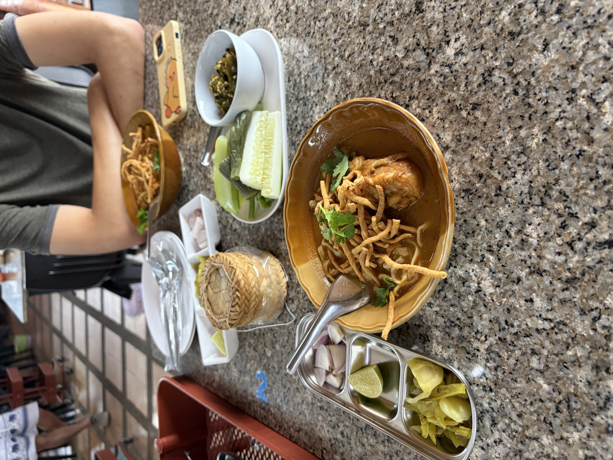
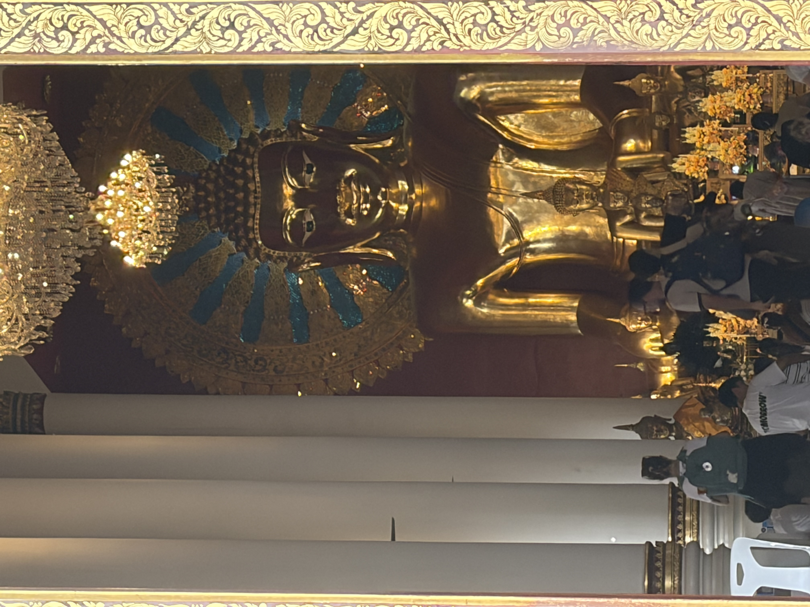
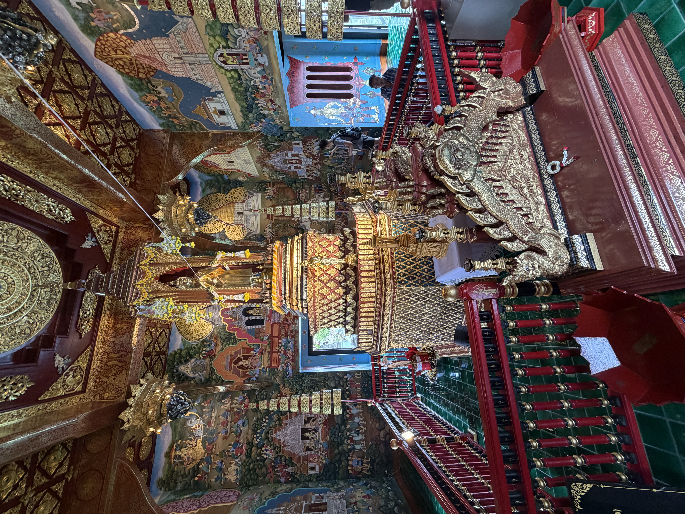
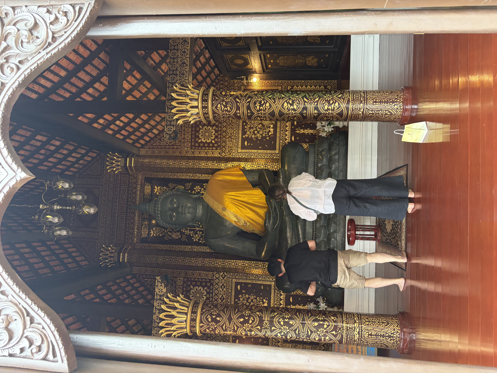
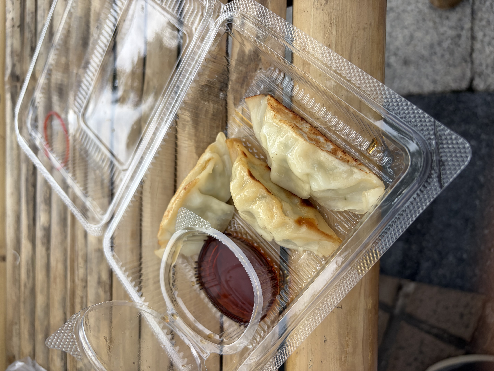
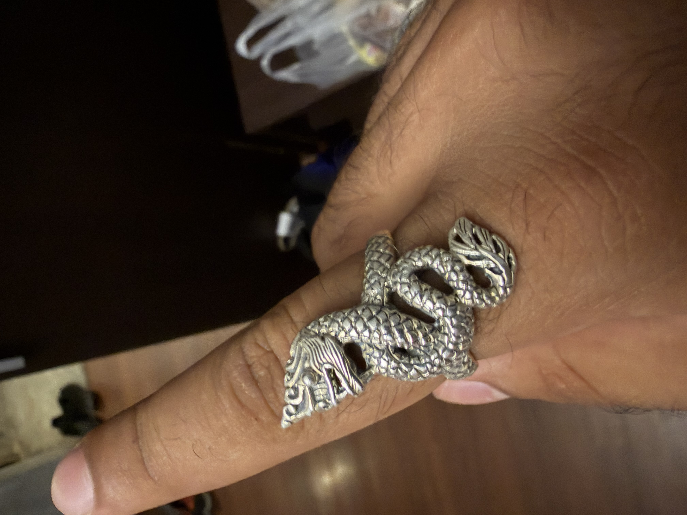
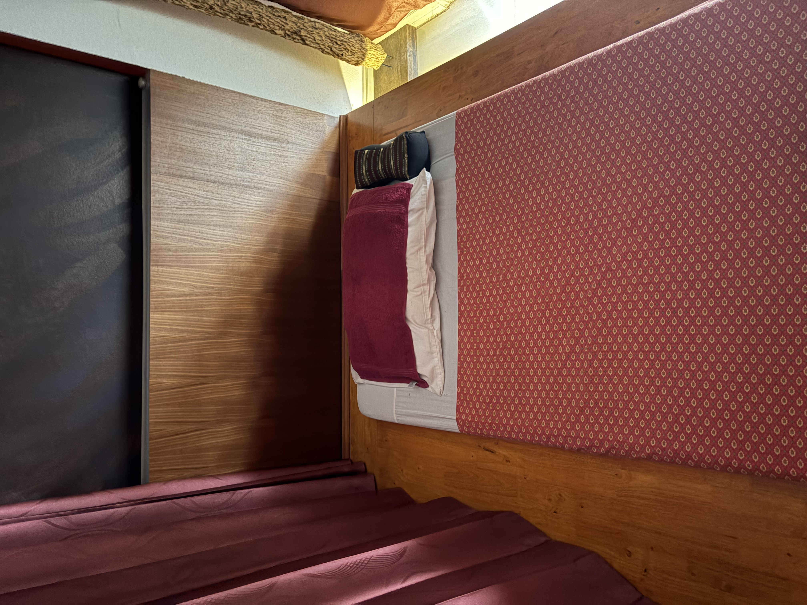
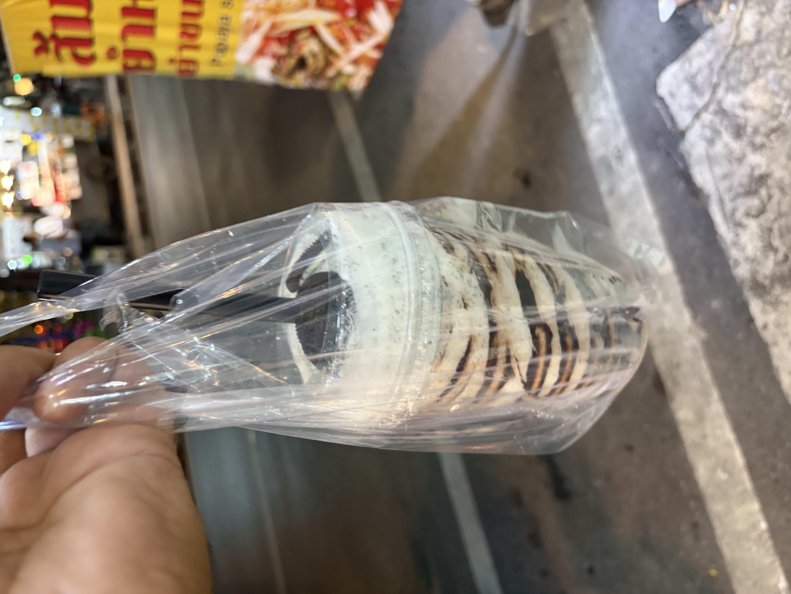

Hey yall! Today was our first proper day in Chiang Mai, and for the most part we just took it easy and light.

# Wandering Chiang Mai

We started the morning on the later end for us. We had been so tired the day before that we just needed to take it slow. We slowly got out of bed and dragged ourselves up and ready. We went to go get breakfast and for today we found a nice place for Khao Soi. Its a famous northern thai dish, essentially being a coconut curry noodle soup, and already we were blessed with an amazing meal, unfortunately I spilled a tad all on my shirt so afterwards we had to go back to change.

After coming back to change, we headed back out, really having no real “goal” for today besides see the city. We are directly in the Old City so we wanted to just explore the Temples near by and get an eye for the culture differences here. The first temple plaza area we had entered into had already been packed, We walked in and noticed a march going on, still trying to figure out what it was for but it was for the monastic school local to here.

Nonetheless we explored, first seeing the outside. Then exploring the inside of the first temple. We had noticed that this first temple did not let in women, which feels weird given this is the first time we have seen this. Apparently this dates back to certain buddhist beliefs for this temple. While it’s not something that affects either Benji or I, for your own travel, it may be something you may have to consider.  Nonetheless a beautiful temple on the inside.

The second temple we had found there was open to all(yay), and was much bigger, and you could see all those praying. It was nice and peaceful

Afterwards, we carried on to the street, we wanted to make it to the 3 kings monument, we first took a break at a coffee shop, and then afterwards got a lil snack at a market, before realizing this market was at the 3 kings monument.

I had chicken dumplings at the market, and they were some of the most flavorful I have had here yet. At the market we browsed, and I ended up buying a silver ring representing the thai naga. i made sure to research, and barter the price a bit down, and it ended up being a fair deal for me overall(still probably got charged a higher than a local person, but better than buying in America).

After this, we decided we were still tired and went back to the hotel for a bit, we had walked around a lot, so we just needed to sit.

# Sharyq’s Second Massage

I decided to let Benji nap and I headed to C&R massage. They had a good deal on a 90 minute oil massage that included the thai massage plus foot and back massage. Now, this place was not nearly as good as Kim’s in my opinion, but my masseuse did a great job. Ill spare everyone the details as it was much of the same thing, but only difference is that I was a tad colder during this one, and the masseuse I had this time did not nearly put as much pressure on me as the my last guy did, and I definitely preferred what he did. Overall good experience though, but unfortunately I have standards now.

# Night Markets

I met up with Benji and we wanted to find some market food, we first walked to the chiang mai night bazzar. We were told it was popular, and it did seem so, but it also rubbed us the wrong way. The food didnt seem amazing, and it just seemed touristy in the wrong way. I like some doing a tourist activities but sometimes you seem something and you know it just is meant to get tourist dollars and it doesn’t have the quality or the heart. So we skipped and tried to find another market, the second market we found was also not our best pick, Benji and I have been to enough good markets to know what they look like, and we once again, passed on this, till we finally found the chiang mai gate market, which did have plenty to offer and was very good. I wasnt in the mood for anything crazy today and I saw a lady making fresh sweet and sour chicken and rice, so I took than, as well as i saw a place making crazy milk teas, and I got an oreo one.

After this we just wandered and yapped the streets, till we got home. Overall another relaxed day, the farther we get in the trip, the more okay we have become not having something big every single day. 

Till Next time,

Sharyq
