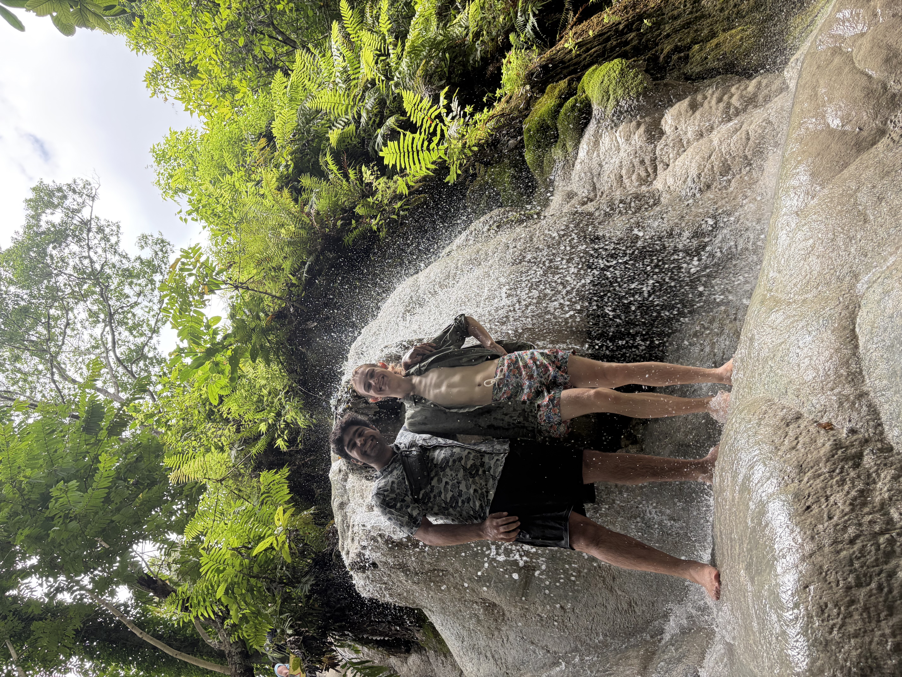
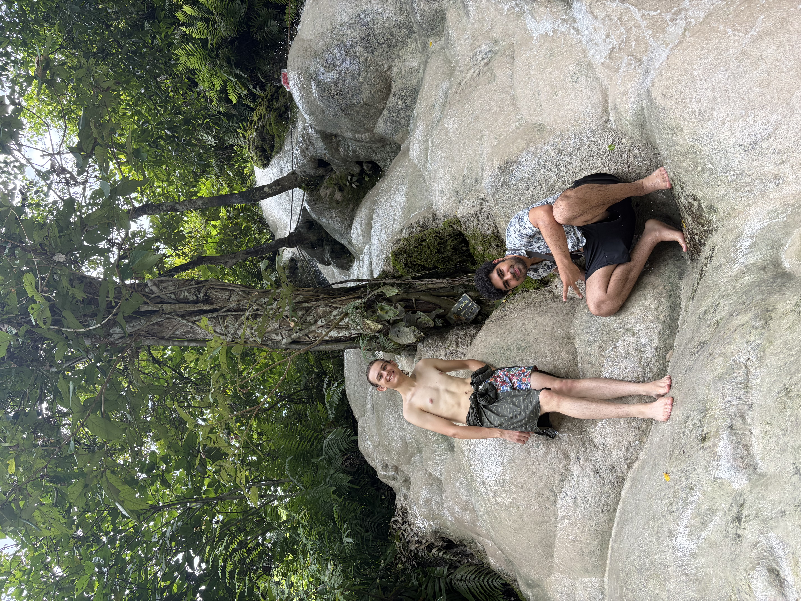
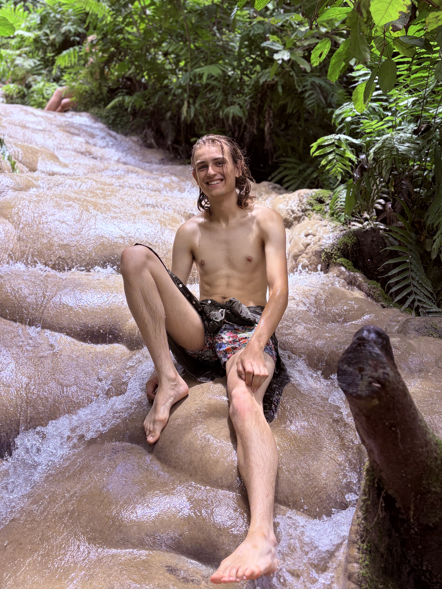
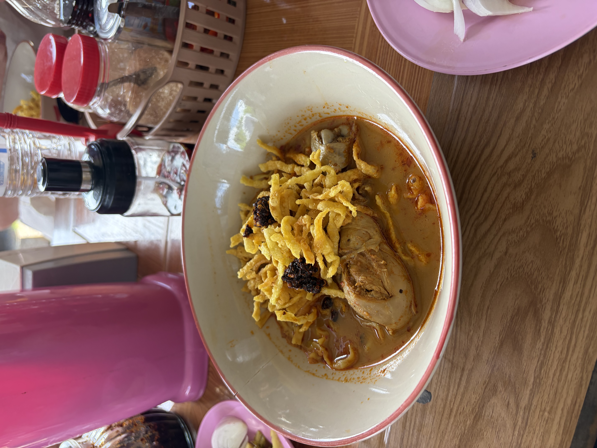
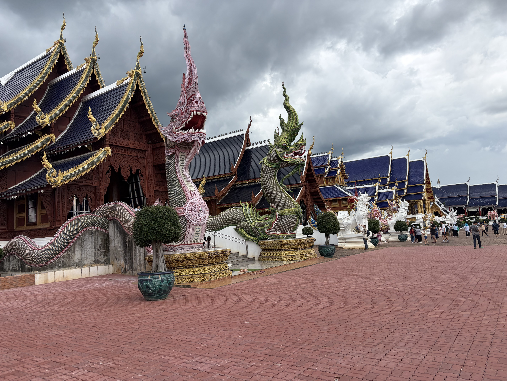
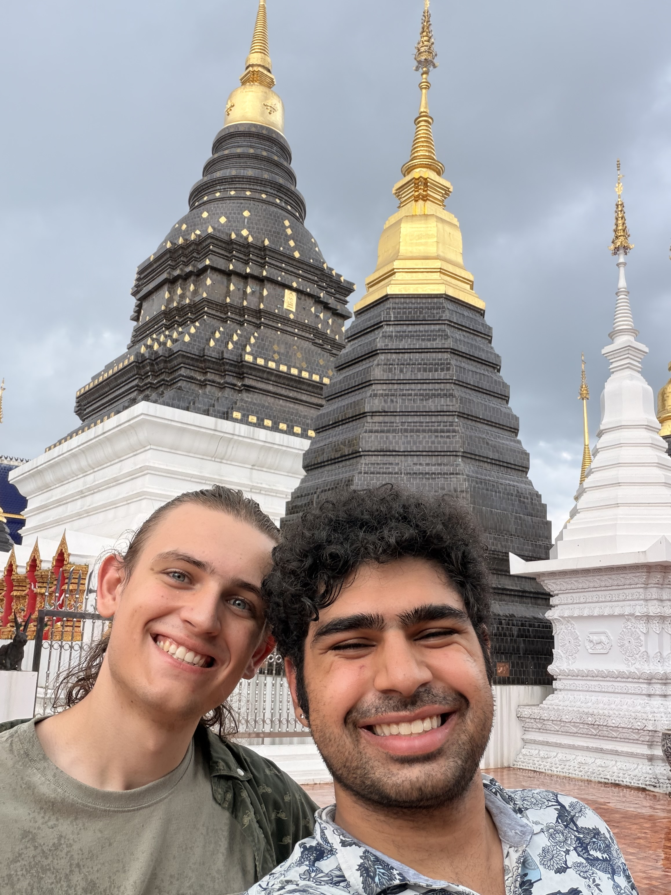
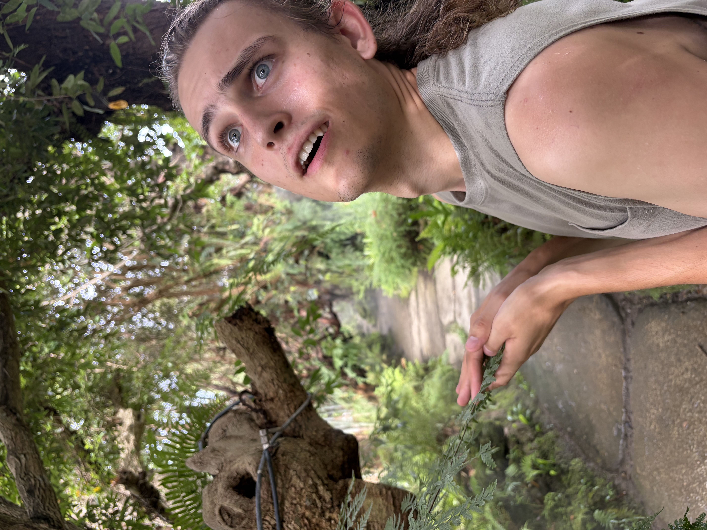
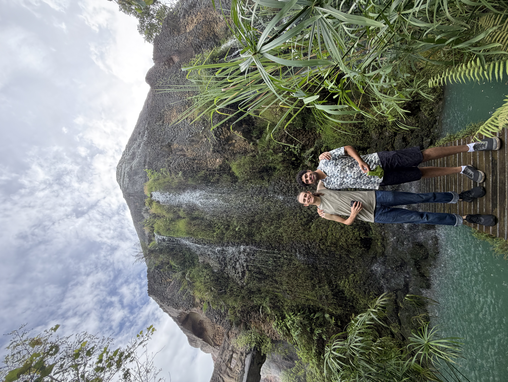
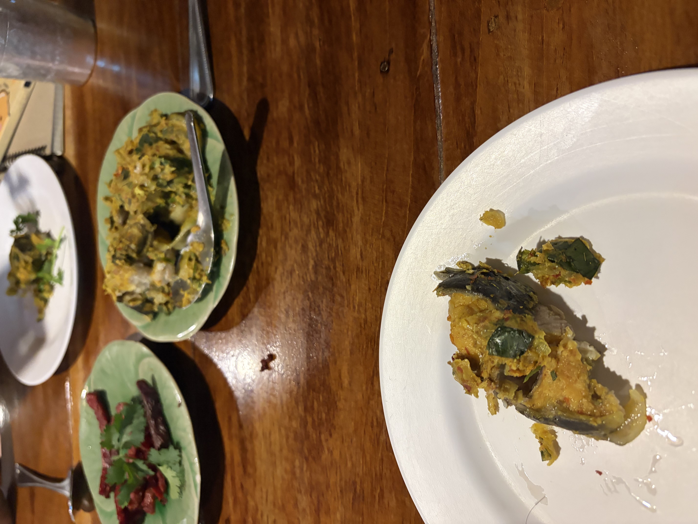
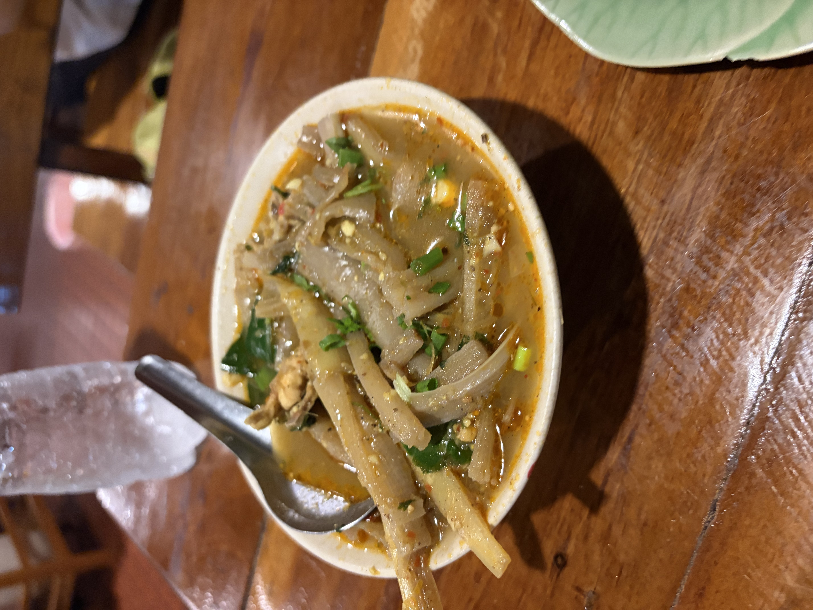

Hey yall! This blog post will probably go up at the same time for yesterdays, Benji and I are currently writing them in parallel given last 2 days have been busy.

# Starting off another Quick Morning

Today once again was another morning we had to be punctual, for the second day in a row, I got Benji and I croissants and coffee before heading out. We got dressed in a lazy fashion and were met by our guide and driver for today, Tong.

We got into the car and were introduced to our companions on this tour, as today we were going to Chiang Mai’s Sticky Waterfalls, Wat Densari Sri Muangken, and the “Angel Lands”. 

# Sticky Waterfalls

Our first destination was waterfalls, and we had a bit of a driver there, Tong stopped us at a 7/11 to get some coffee or food if we needed, I unfortunately was car sick. When we got back in, Benji had me situp front, so I got to get to know Tong well.

He was such a character, he labeled himself “Tong Cruise”, he had plenty of jokes to make and had a story for every area. He saw the picture of my partner on my phone and commented, “you only have one? When i was your age I had 10, dont tell my wife that”. Very sarcastic and liked messing with everyone.

We got to the Waterfall first, we ended up changing into swimsuits and exploring around first, there was a spirit house nearby that Tong showed us while explaining why the sticky waterfalls were sticky. The spring the water comes from contained a calcium carbonate that made many of the stones have traction rather than making them slippery.

We eventually begun our trek down, as we climbed from the bottom of the falls up.

The water once again was a great temperature here and the rocks weren’t sticky but rather had plenty of friction, still though Benji and I were still a tad scared of falling.

From here Tong took plenty of pictures of the entire group as we climbed, sharing facts about how artisanal coffee being made of elephant dung(black ivory coffee, real thing) and that he could absolutely start a business for it if he just market it right. All while climbing.

We reached certain peaks where we would get told some lessons about the nature around us, such as the bananas, the spiders, the very hairy caterpillars. He gave us insight into what this jungle was like.

The climb for Benji and I was easy, to the extent we were dashing ahead of everyone in many cases. But we eventually slowed down for everyone when we went on a path off from the main crowd so Tong could get us some space. 

Once the climb was finished we climbed back up we changed back into normal clothes and headed off to lunch.

Lunch today was once again Khao Soi! Loved it the first time(and this time i didn’t ruin my shirt). Little spicier than the first time but wasn’t spicy enough for me(I hope Benji talks about my arrogance regarding spice yesterday).

We ended the meal with some Durian ice cream, and outside the smell, it tasted great.

# Temple time

Our next trip was to the Wat. This one was one of the largest we had ever been too, and it was named after its blue roofs. This was a mixed buddhist temple(consisting of both chinese and indian derivatives of buddhist structures).

We had hit up a total of about 7 different temples here before it started raining. 

Now the smart thing would have been to go back to the car, but there was still so much to explore… so we explored in the rain.

We eventually got back to the car and was later informed by Benji that we may have been 10 minutes late.

# Angel Lands

Our final destination was the angel lands, it was a property bought in 2020 renovated and made into a garden of some sort with man made waterfalls. 

We got in and immediately Benji wanted coffee and I was surprised by 35 baht coconut pancakes, an offer I could not refuse.

We explored for a while seeing the falls and the gardens.

After a bit we finally decided we needed a bit to sit so Benji got a Lemon Honey Soda while I got a Longon Soda(tasted like a sweeter lychee)

After this things wrapped up and we were dropped off by Tong, but not before he could crack a few more jokes, talk about his family, and his home in Pai, and giving us fist bumps on the way out. Awesome tour.

# Special Dinner

For dinner we went to Huen Muan Jai, a restaurant Benji’s Mom had been too when she was in Thailand. We got a Grab, and we knew the place was gonna be crazy when we were told we had a 40 minute wait. We ended up waiting those full 40 minutes, and it was worth it. 

To start we got sundried beef, and a fried fish, both evicerated before i could take a picture.

Next up came some mushrooms with a chilli dip, both Benji and I were okay with it.

Finally we had the soups, one was a banana red curry with chicken and the other a spicey fish head soup.

This meal totaled to ~500 baht and it was ABSOLUTELY delicious. The kitchen closed before we could get dessert(really wanted to banana and coconut milk) and the only thing Benji wishes he could have had was the derp muang, a plater of various pork items, but they were out(doesn’t affect me but unfortunate for him).

Now as we speak, we are on our way back to the hotel, most likely to have a quiet night in, catching up on blog stuff and resting because god we are tired.

Best regards,

Sharyq
