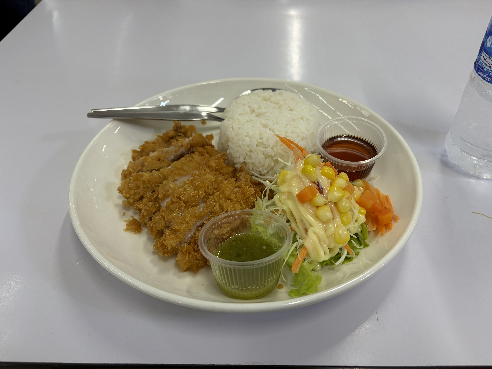
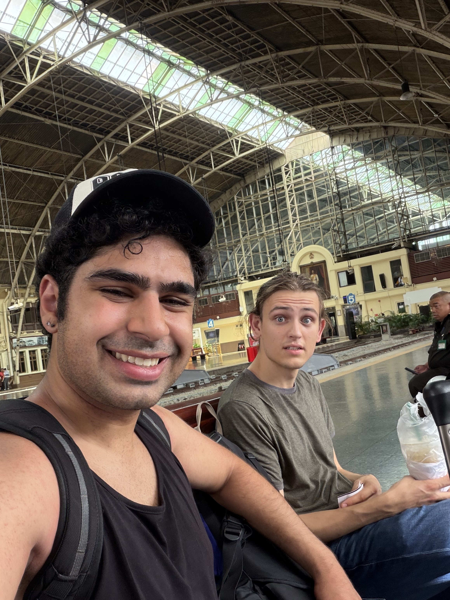

Hey yall!

We survived the flights! I ended up sleeping for more of it than I expected. Though as a result of being in the airport, our Tuesday was basically just all air travel, and there isn’t much to talk about besides getting coffee in Hong Kong Airport.

# Arriving in Bangkok

We arrived at 9 am. Got through customs with ease, and immediately got on to the BTS Skyline train, one of Bangkok/Thailands many modes of transportation. Benji did some searching and we ended up in Ratchaprop to find food and just wander. The train ride was utterly beautiful, and gave us a sky view of Bangkok. 

# Out of the Train

Immediately we were launched into a very densely populated area, full of both the Indian neighborhoods, as well as just general markets. We ended up just walking around seeing the area. We first found a little food market where we got drinks and Benji got a skewer. When I had told the lady working the stand “Khob Khun Kha” (thank you mam) she smiled and seemed so happy. So either she appreciated my effort or I said it horribly wrong, either away she seemed amused.

After that we wandered around, bouncing between places with AC, and finally got lunch at this market where benji got a chicken feet soup and I got chicken fried rice!

# Wrapping up the Day

After this, we ended up taking a train to our Hotel, got organized and give ourselves a break from the heat. We ended the day with dinner at a place called Common House, and i got a chicken walnut rice that was delicious. Overall not a complex day, not too eventful, but  was a great introduction to what our trip will be like!

\
\
Sincerely,\
Sharyq
