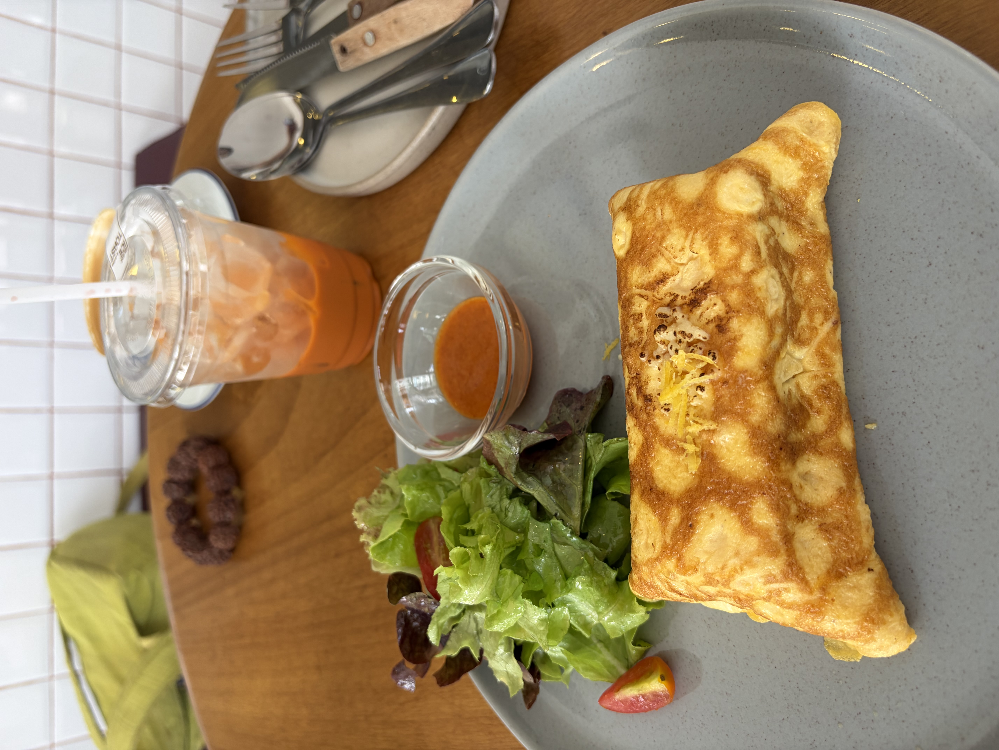
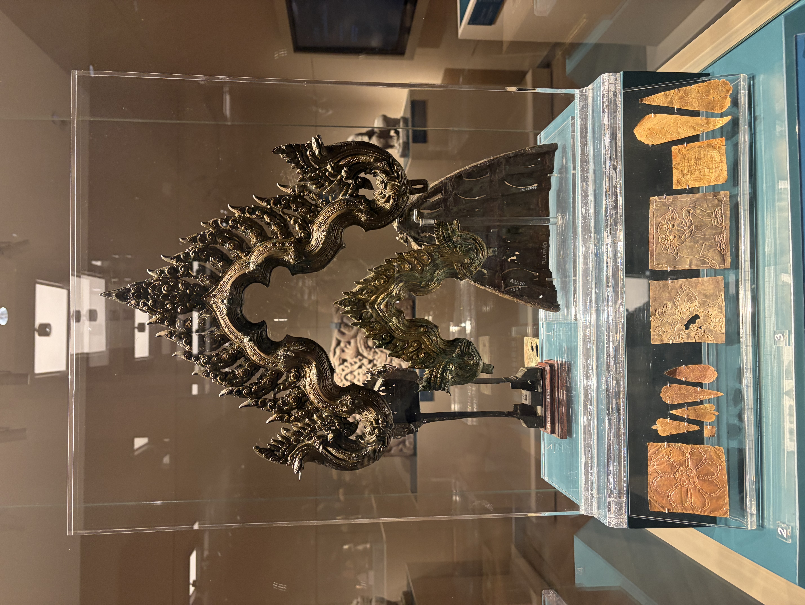
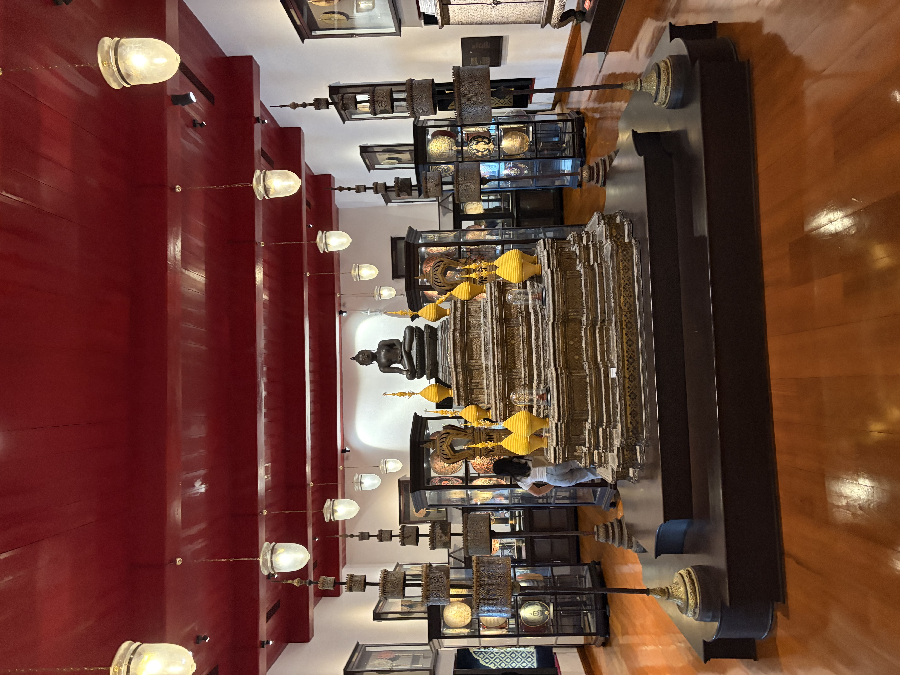
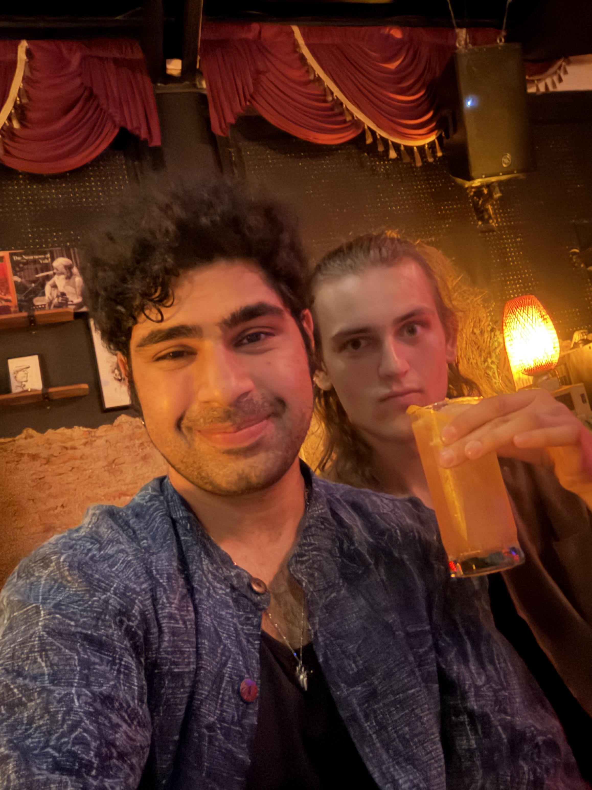

Hey yall! Getting these out daily in bangkok have been a lot harder than expected, lots of late night activities taking up our nights, so this is coming out later than i expected, but Bangkok has been treating us so well!

# Day 1: oops all shopping

Today was entirely dedicated to Chatuchak Weekend Market, the largest open air market in all of bangkok. We started our day a bit late, where Benji and I got breakfast seperately, and i got a beautiful open faced gochujang chicken sandwhich. Afterwards we headed towards the market

When I say this market felt infinite, i mean it was infinite. Benji and i spent a total of 5 hours there and it took us an hour to get there from our hotel. For majority of this trip, i had one mission and it was to get a new pendant. Benji developped a mission of getting a Guanyu(god of war and prosperity), so we explored a few primary sections, first the sections 6-8 which were supposed to be gifts, where we ended up buying stuff for our friends and family(cologne, jewelry), but no luck for me there, so we went to sections 23-26 in hopes and wandered there. 

Along the way wandering through a bit to get there, Benji found a mini guanyu as a necklace and bought 2 chains. Alas, every place I went to did not have what i was looking for, it was frustrating. We took a break for lunch and I got Biryani to cheer myself up.

We searched for long, getting ourselves shirts, stopping for coffee where I got to play the owners guitar, and eventually just finding our selves in different sections. Trying to navigate this place was horrid, it felt like a labyrinth of shopping, and both Benji and I felt lost.

Finally, I found a place I liked where I bought a pendant that looks like an anatomical heart and a pair of earrings. My goal had been achieved, my hero’s journey was complete, so I celebrated by going to the ATM, getting more cash so i can buy myself a sprite.

After wandering a little longer, we left and ended up going to the 9th largest mall in the world, Centerworld. If chatuchak market was massive, this place was an entirely different beast, we got lost just trying to find the food court. We ended up getting there, getting some drinks and wandering a bit to find a stationary store.

For dinner I got a banh mi and a mango sugar cane drink! We sat there for an hour just yapping before realizing this place had a movie theatre, so we saw the new Spider Man movie, and it was amazing! We did get out of the movie at like 1 am, and ended up taking a grab back to hotel where we crashed

# Bangkok Museum Day

Okay now day 2, we once again started the day late(wow I hope this doesn’t become a trend) and today we wanted to go to the National Museum of Bangkok. We started the day off by going to this cute bakery near by to get this lovely egg and toast, then headed off.

It took us about an hour between train and walking to get there but we eventually got there, and this place is huge, we could have easily spent another entire day there, but we went to 2 primary exhibits, the archeological exhibit and the art and music gallery.

The archeological exhibit covered a lot about history before the kingdom of Siam was made in the first half, and then history of Siam in the second half.

The art gallery shower off instruments, art pieces, and just general culture throughout the ages of Siam and Modern Thailand.

Overall this museum was amazing, dont have much thoughts other than every exhibit was beautiful, but the size of the museum was so incomprehensible.

# Jazzy Evening

Benji and I decided to split for a while in the evening, we needed some alone time, and while he went shopping, I went back to Iconsiam, i was hoping to get a new pair of sneakers given the ones I have been rocking this month, while have treated me well, have been killing my feet. I took one look in the stores and i realized “naw im not doing that” so i ended up just buying myself an iced tea and walking around since Iconsiam is just so beautiful.

We met back up in Bang Rak, as we wanted to go to a jazz club there, and we ended up getting dinner at this local place, and the owners were just so nice, and seemed so happy to have foreigners there.

We got to the Bangkok Mojo Music Lovers, Jazz Club, around at 9:30 and got 3 drinks each and just enjoyed the show. Sunday is jazz night with the house band and they did not disappoint, i was entranced the entire time and I lost track of time and we ended up leaving at midnight. Truly, if you like music, go here, its a local community, and they are so talented, great vibes.

Thats all, simple few days in terms of activities, but they were amazing full day activities.

Stay Jazzy,
Sharyq
