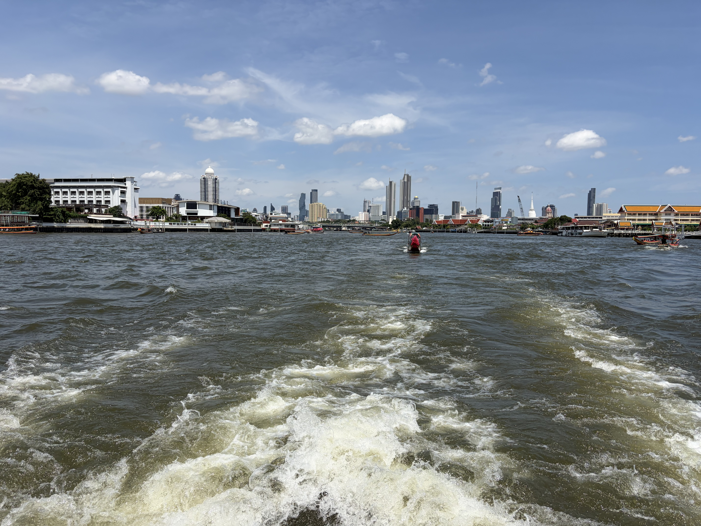
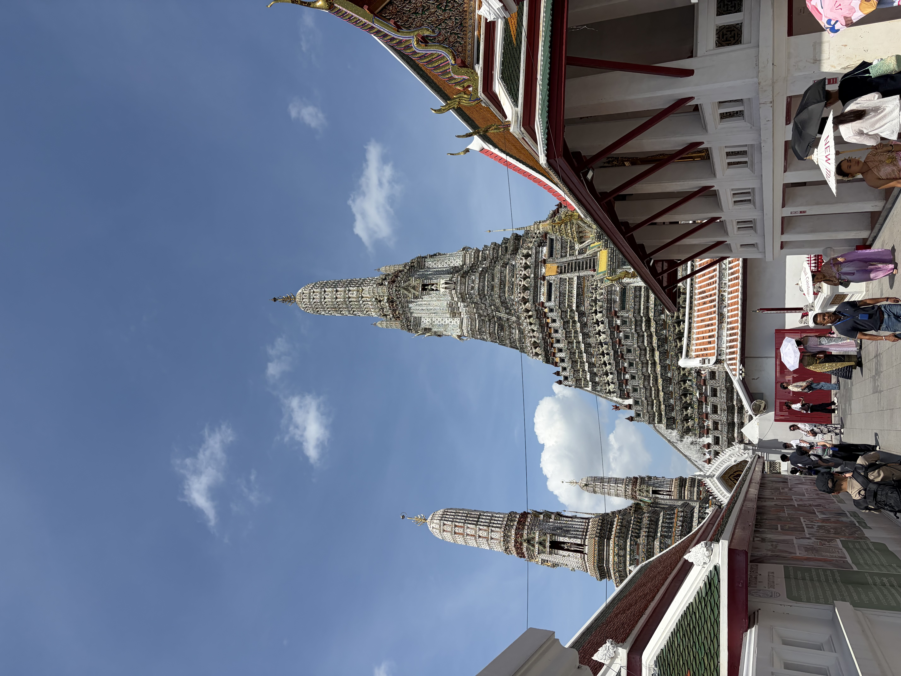
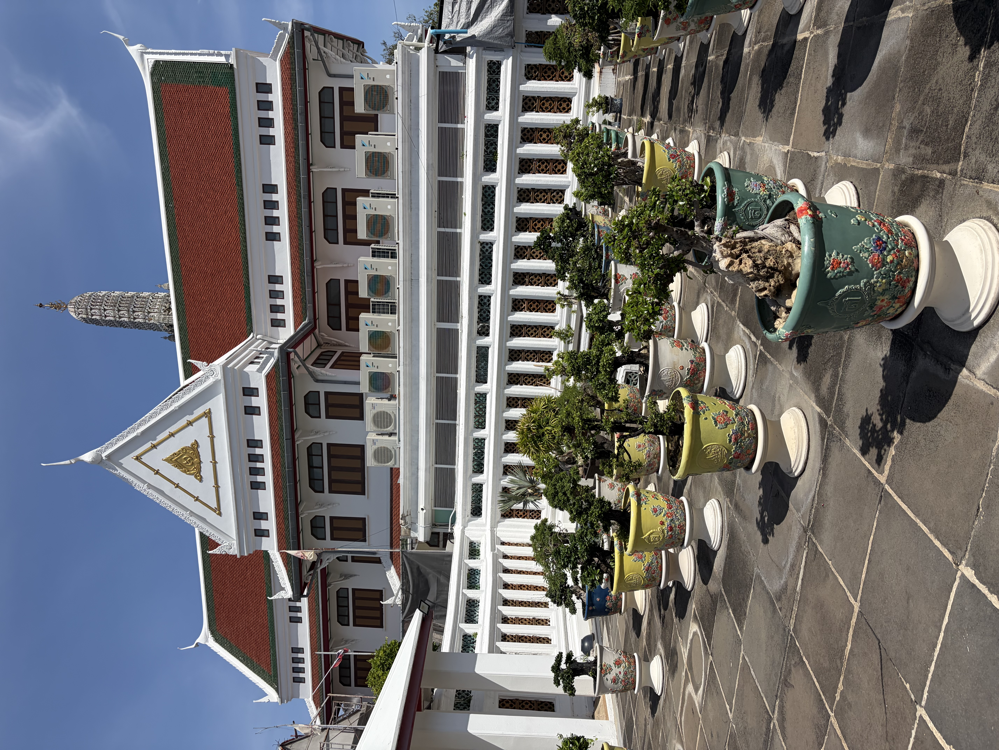
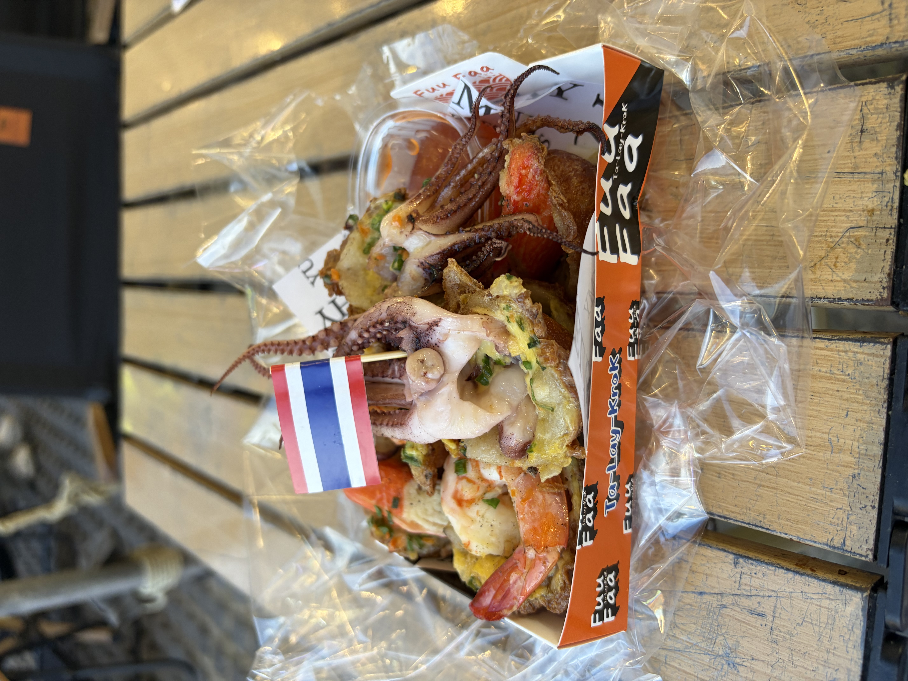
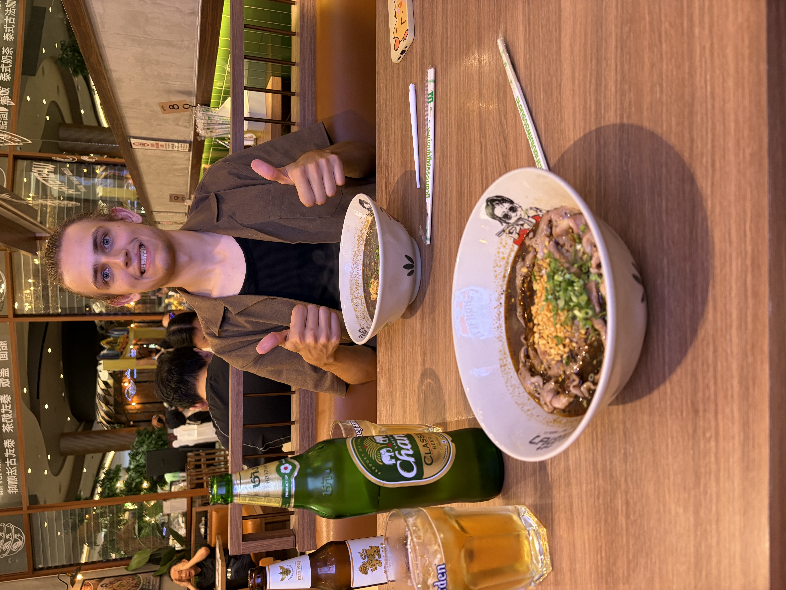
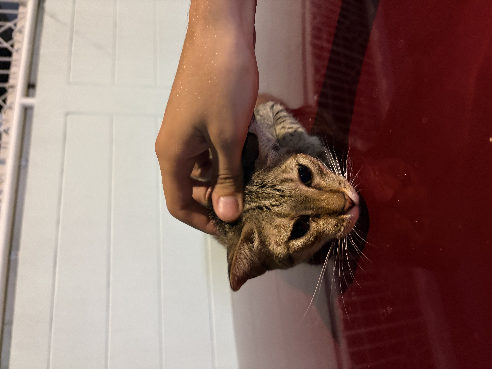

Hey yall! Welcome to the last post of our trip! Its been a great 2 days in bangkok. As per usual in this part of the trip, it has been hard to just keep up with the blog, just coming home tired and waking up late, but as I do this on our last night here, I feel happy with our last little journey.

# Wat Arun

This mornings plan was to go see Wat Arun, Bangkok’s most famous temple. I first went to get coffee for me and benji at the cute coffee shop, Old School Coffee, just some basic drinks for us, then we got a brunch at ICONSIAM of some street food things, i got shrimp and samosas.

Afterwards our journey began, we first took a ferry from ICONSIAM to Wat Arun. Initially when the guy had told us when the train was, i thought he said “15 minutes” in thai, but what i actually realized later was it was “at the 15th minute” as in at 15 minutes into the hour, which was in 3 minutes. As a result i had to call up Benji a ton to get him back faster while he got a drink.

Our ferry ride was short and we eventually got to Wat Arun, and while beautiful, it was crowded and very sunny, so we wandered around it for a bit, but left after about an hour because it was too much.

Today was on the hotter end so we ended up taking a break for a bit in a coffee shop just to recover, and decided we wanted to check our Chinatown, and we had ended up once again in another infinite market, exploring so many different stores and Benji and I ended up buying hats matching the beers we have been seeing mostly in Thailand(Singha and Chang)

# Nightlife

After this we ended up leaving to go to Jodd Fair market for dinner where i got variety of fried seafood and some great mango sticky rice and egg custards.

After this we ended up going home, changing and we wanted to see a lot of Thailand nightlife. Because it was a Monday, it was much quieter on Soi 11, so we got bored and tried to go home, but on the way back we saw a giant cowboy hat in the distance and we said “lets check it out”

So we accidentally ended up walking onto Soi Cowboy, which for those of you who dont know, its a big party street and especially know for its more adult audience target(if you get what i mean). As a result when walking down the street, a bunch of women tried hitting on us and bringing us to the bar, and as a result of not wanting to deal with it, Benji enacted what he calls “Gay Mode” and wrapped his arm around me so that it looked like we were a couple so people would stop touching him. We got out, got a drink from a more tame bar, and then went home to crash at 1 am… again.

# Last Day Responsibilities

Today, was a lot more tame, another late start, where I went to ICONSIAM to do some last minute gift shopping for friends and family, and I got Korean Fried Chicken, another Mango Sticky rice, and a Grass Jelly Thai iced tea for my last time on this trip.

We ate our food together, then decided we needed a couple of things. Firstly, Benji wanted to visit Mochi Mochi, probably our favorite chain here, for the last time to get another bag, secondly, I wanted to go to this shop for a designer postcard, and finally we wanted to get Benji a new Mortar and Pestle.

The first one was easier than expected, we went to Siam Square, and wandered the mall for a bit till we found it, and Benji got it, as well as we got a sticker of us from Sticky Waterfalls.

After that we travelled to Terminal 21 for find the store Linecense, it took us way longer than we needed to find the store, which made it so much more underwhelming when we finally got there, i did get a cute little postcard, but we were a little disappointed after that.

Finally, we found a spot to go to for a mortar and pestle, a small shop called Thai Hong Seng in Chinatown, the lady was so nice, and talked with us for a bit, talking about how a famous chef buys from her humble small shop. We picked out the mortar and pestle and as we checked out, she said “you know you can get this in america” and Benji responded with “I know”.

# Enjoying our Last Night

After spending some time relaxing, we got dinner at a boat oodle place on the 6th floor of ICONSIAM, we went all out for this one, getting wagyu boat noodles, a bear and dessert afterwards. From here we just yapped the night away, enjoyed our food, and looked at this beautiful bangkok night time skyline for the last time.

I plan to do an epilogue to all of this, giving my tips and recommendations for thailand trips, but to all of those who have followed Benji and I on this trip, and read through my rambles: Thank you, Im always so happy to get texts based on the reactions people had to my latest post, and Im glad that the memories of this trip are immortalized somewhere. When Im back in the states, I plan to print all the blog entries out and make them into a little book for for Benji and I before we both go our separate ways for Grad School, and as much as some days had varying quality, I am extremely happy looking back at these entries we wrote. Thank you again. See you all in America.

Sincerely,

Sharyq
