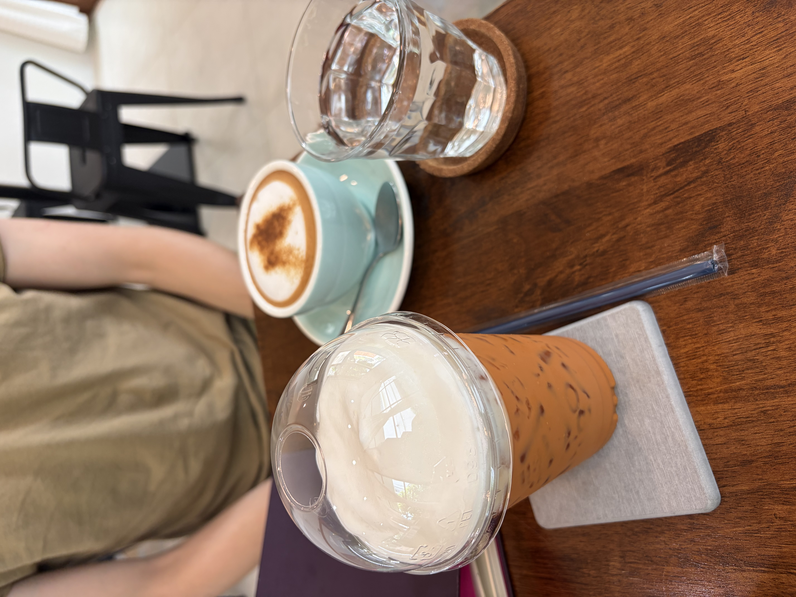
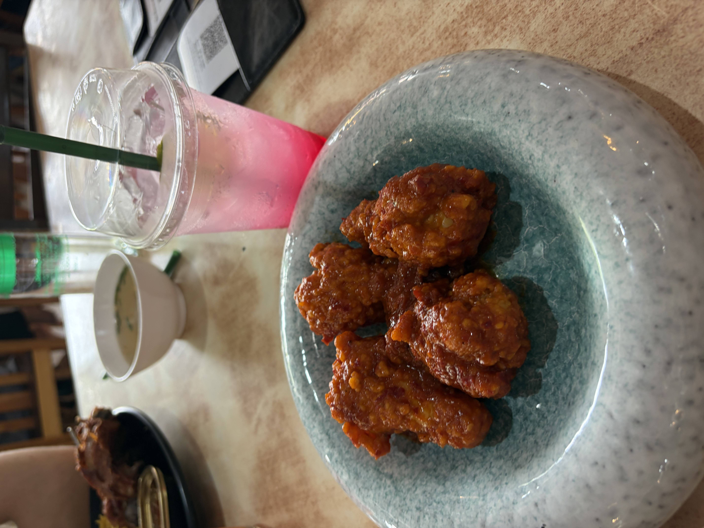
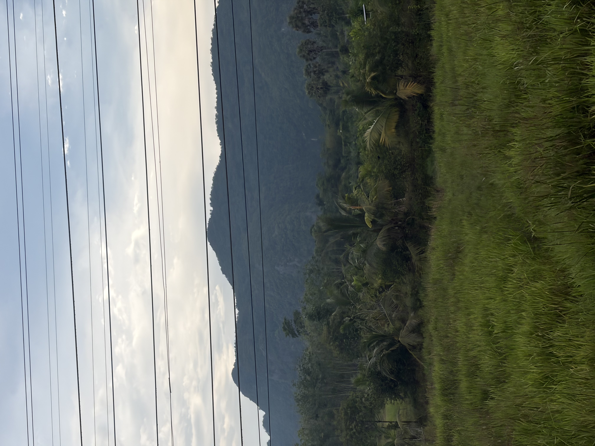

Hey Yall! Today marked our second day in Hat Yai, and we started the morning off by going to a breakfast place down the street from use, where Benji got a pudding and I had a bread with a Pandan dip! From there, we went back to the hostel, and the lady who ran the place asked to take our picture. In the hostel there was a picture of every resident who visited, so we were being added to the wall(if you ever stay at Khok samet chun hostel, try spotting us)

# \
Municipal Park

After the checkout, we got a Grab, and headed to Municipal, a mountain with temples and hiking trails. At the point, we got to see the entirety of Hat Yai from a birds eye view, and got to see 4 large budha statues

Once we walked down the mountain a bit we reached one of the temples, one in which that had statues representing different deities such as war and mercy. Many people were doing prayer here, in hopes of maintaining peace.

\
After this, Benji and I just hiked down the rest lf the mountain, looking around the ponds we found, exploring smaller outposts setup and just having a nice hike down the mountain in general.

# \
Afternoon in Town

After this, Benji and I needed some down time, so we decided to go to this small coffee shop called Kaffe 25. It was a cute and cozy little coffee shop owned by this one older gentleman. 

We each got drinks and read our books for a bit before asking the owner if he knew of any good local places to eat. He gave us directions to a hat yai fried chicken place 3 minutes away, and by far this was my favorite meal yet. I had Chicken Golae while benji had Biryani and Friend chicken and this place truly killed it for me.

We had spent plenty of time in there, just chatting before going back to the hostel and taking our stuff and walking to the local mall. There we had bought several things: benji got a new phone case, I got a handkerchief and an umbrella, and just some goods from the pharmacy we need over the next few days. What we didnt expect to find there was an art gallery.

this image is not representative of all the art there, but there was art of all sorts of styles from all over asia(and apparently there was some polish artists as well), we spent about an hour here before heading off to our train to Phattalung.

# Getting to Trang

To get there we first took a train to Phattalung, a town between trang and hat yai. There we explored a small market and I got some chicken skewers! From there we caught a bus that brought us to Trang, and the view was gorgeous, being a very mountainous area of Thailand.

Once we got to Trang, we went to get dinner at a local plave close by to our hotel. The menu was completely in thai, so a couple had decided to help us out(us being very clearly foriegners) and got us good food! I had a chicken fried rice and. We had a seafood tom yum soups. We got to talk with the people who helped us order(their names where Dat and Fan). They were from Phuket and were just in town for the night. More than anything, people here have been so kind to us, and very supportive of us given we are foriegn to the language. We ended the night by going back to the hostel and doing some transportation booking for the next week. \
\
Thanks for checking in with us! Im about to crash, see you all tomorrow.

\
Cheers,

Sharyq
