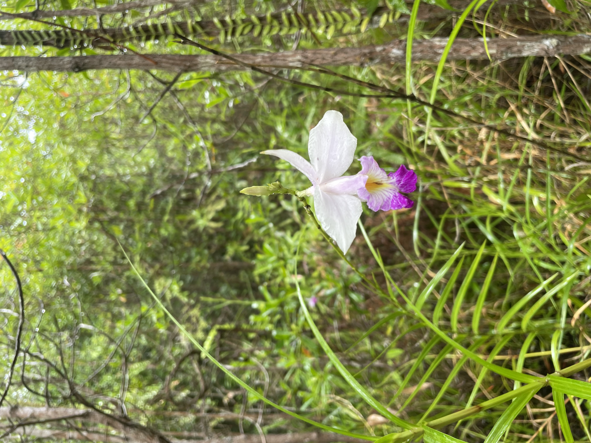
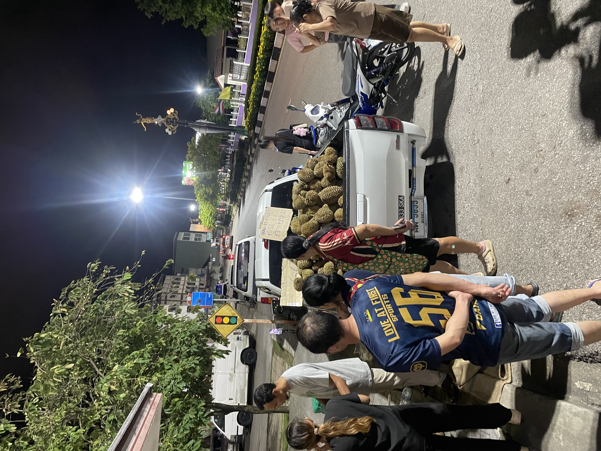
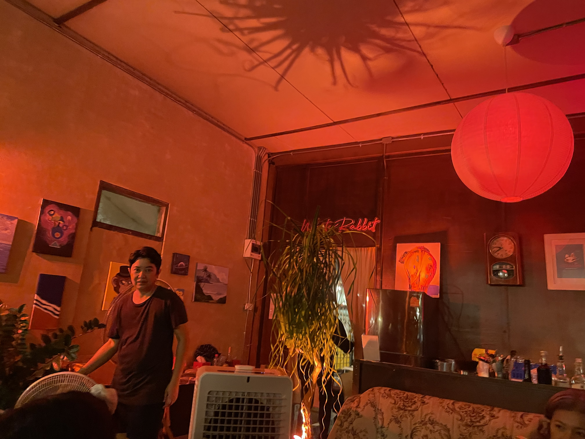
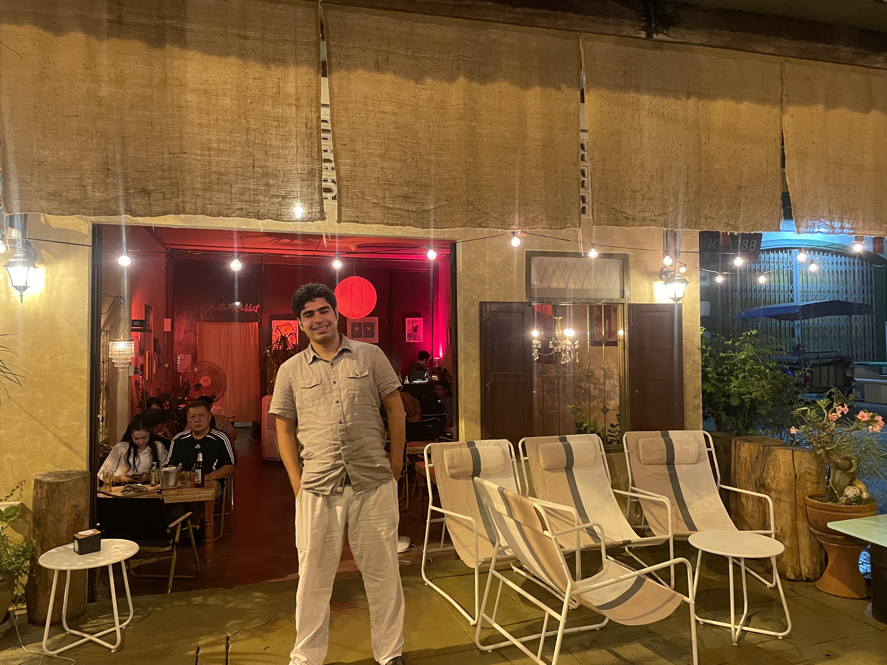

# Early Morning

We started the day off with an adventure to get some dim sum. The book I had read, The Food of Southern Thailand, had mentioned that Trang, with its large Chinese population, had some of the best dim sum in Thailand. It had also mentioned a place by name, so we headed to where Apple Maps said it was. 30 minutes of walking later, we find that this place is not where Apple Maps thinks it is, so we double back and go to a different dim sum place that we had passed. We entered a monumental hall, on once side lined with fish tanks and medieval boat models, and on the other by an array of fridges packed with endless varieties of dim sum. We sat down at a table, ordered drinks, and went to the fridges to select our dim sum. We took maybe 8 or 9 small metal plates out of the fridges, each with two pieces of a variety of dim sum, from fish on greens to shrimp dumplings to pork and sticky rice wrapped in banana leaves. We then gave our tray to a staff member , and they all returned to us 15 minutes later, steaming hot in bamboo steamers. This was a delicious, though extremely filling, breakfast. In addition to the dim sum, I had taken upon myself to sample some fried pork belly, a Trang classic dish, which was sweet and crunchy, with a jerky-like bite. After this substantial meal, we walked to a local mall to pick up some water for our next activity: the botanical gardens. As I placed the water in my shoulder bag, the zipper slipped onto the zipper cover and, after my attempts to fix it, completely detached from one end of the zipper, rendering it useless. $20 later, we had found a new bag pack to replace my fallen comrade for the rest of the trip. Luckily, the bag had broken in a mall, where it could easily be 

# Trang Botanical Gardens

A minute after we left our grab at the botanical gardens, the driver returned, told us that the grab app would not work so far from the city center and gave us his phone number to call when we needed a ride back from the gardens. We knew he would probably overcharge us for this, but what is a few dollars when the alternative is being stranded in the rainforest. At the botanical gardens, we saw so many beautiful plants, from ground and epiphitic orchids to ferns to palms to massive trees from the fabeceae family. Everywhere we looked, there would be a plant, and then several plants growing atop it. There were elevated walkways so we could experience the jungle canopy, which was quite fun, though the doorways definitely spooked us and felt a tad sketchy. Back on the ground, there was a pathway through a more marshy area, which we were walking through when it started to rain. It started to rain in the rainforest. And I hadn’t thought to bring my poncho or umbrella. To the RAINforest. Luckily, there were little shelters along the path, which I deleted between while Sharyq enjoyed the cover of his umbrella. We called our driver friend to take us back to the hostel so we could change out of our damp clothes. 

# \
Trang City Center

We had inch at a much fancier place than we have enjoyed previously. I ate a short rib and stinky bean curry while Sharyq had some shrimp pad Thai. I have really enjoyed these stinky beans, which are actually bean pods from a species of tree that grow wild here and have a distinct smell that lingers in one’s mouth. They are slightly bitter, which is nice for when you have a bit too much to eat and need to quickstart your digestive system. Sharyq allowed his inner child to emerge and ordered an ovaltine and I had a frozen coconut drink. We walked off lunch by exploring central Trang. We have notices that Thai towns are a lot more spread out and a lot less walkable than we had hoped, and unfortunately there was not too much to be done in the city center other than look at some street art. We explored the local market, where I eyed up some stinky beans but decided not to get any. We stopped by a cute coffee shop to kill time and have a quick read of my book, The Castle. We went back to the hostel to take a quick rest before going to find dinner. On our way back to the hostel, we passed by an old woman selling stinky beans and I gave into temptation, buying a bundle for 20 baht. 

# Evening Out

We went to the night market for an affordable dinner. I got some fried chicken, a package of sticky rice and pork wrapped in bamboo leaves, and a ‘pancake’ stuffed with coconut and sesame. Sharyq got two Korean corn dogs, one with a mozzarella stick and the other with a chicken sausage. We had split up to find our respective meals, and took a good 10 minutes to find each other again, even though the entire market was only one street long. I realized I had gotten too much food after I got my fill after finishing my fried chicken (this fried chicken was in the style of Hat Yai, which I could not get enough of after yesterday’s lunch). I took a few delicious bites of the sticky rice and had a slice of my pancake desert and called it a night. On our way out, we passed by a pickup truck with a good 10 people gathered around, filled to the brim with durian. 

We finished off the night at White Rabbit, an adorable little bar with an amazingly cozy atmosphere. We each had a different local beer and chatted for an hour, during which we witnessed our first rainy-season downpour, which died down before me had to go home. All together, today was a wonderful day filled with stinky bean, beautiful foliage, and the wonderful small town vibe of Trang.

Sincerely,

Benji
