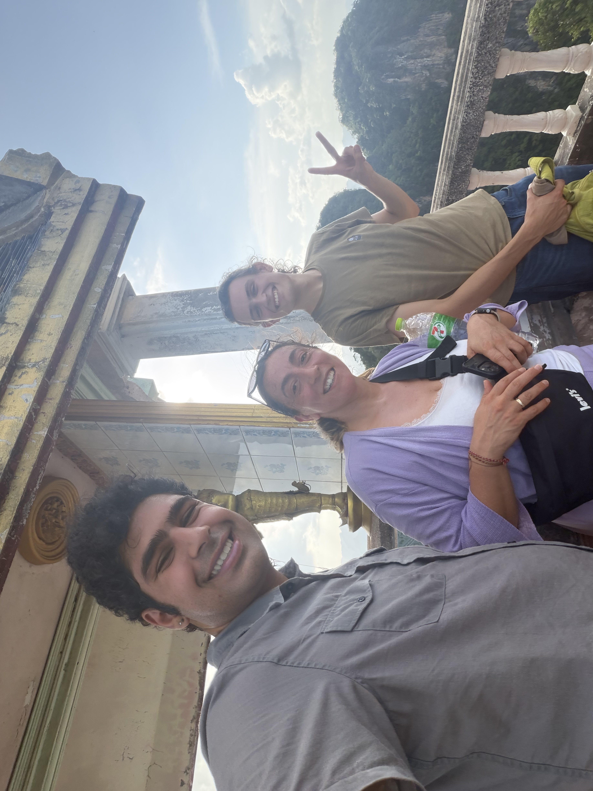
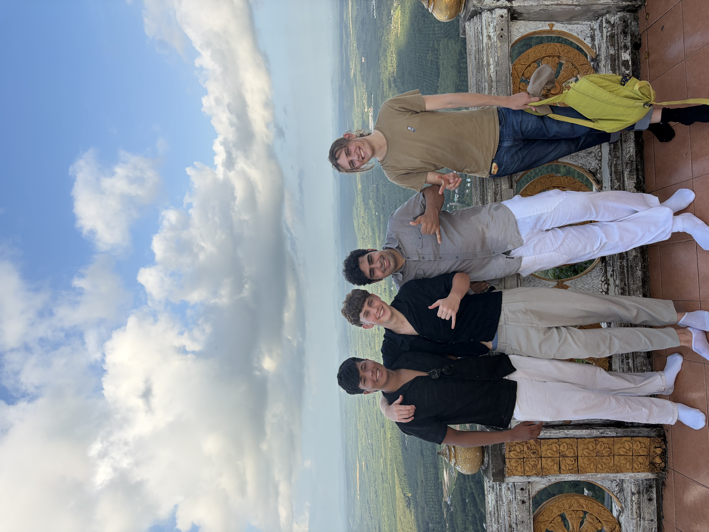

Hey Yall! Today was Krabi day! Today we started off today an hour late because my alarm wasn’t set right, ended up being alright though, we ended up going to a local dim sum place. Trang has a big Chinese population so we had great buns, shrimp, and egg. From there we had went to the Trang Bus Terminal and bought bus tickets to Krabi. We both got coffee and then headed off at 10:30am.

# Arriving in Krabi

Upon getting there, Benji discovered that his bag was drenched in a bit of coconut water that spilled(unfortunate that his bag troubles continue). We were approached immediately by a guy to drive us into town. He runs a taxi service, and we decided to take him up on it, and he was really funny and fun, unfortunately he up charged us 50 baht at least for the ride to our hostel, which is negligible, but still sucks, so we will probably take a grab to the terminal tomorrow.

\
After we checked in, we ended up going to a hot pot place for lunch, Shabu Kong. It was about 500 baht for an all you can eat buffet, and while expensive, it was worth it, getting several cuts of beef, jasmine noodles, baby corn, mushrooms, bok choy, and other things in both a sichuan soup and tom yum, it was very tasty.

# Anyways, we climbed a mountain

After lunch, we went over to what is called the Tiger Cave Temple, a large area with plenty to see, notably a temple, a couple of caves, and a mountain. The temple was beautiful, much more grand to than the ones we had seen been to in Hat Yai. We got to see a monk do a ceremony there, it was very beautiful to see the history of the area around the walls of the temple.

\
Anyways, we started climbing. Being completely honest, when we started, we didn’t bother looking how far up we are going, or how many steps it would be, but it ended up being about 300 meters up on 1,500 very steep steps.

as we begun we could already feel that this was going to put a lot of pressure on our legs, so we tried to take breaks at some major stopping point on the mountain trail up. We ended up making a friend, a German/Turkish Lady who wanted to explore the mountain, we ended up chatting with her most the way up about life, and her own travels, in which she started at the north of thailand and is moving towards Singapore with her husband. 

The mountain took a lot out of us, I already sweat constantly here, but this place drenched me, and Benji, was almost matching my levels. We eventually also ran into this these 2 guys around our age from the Canary Islands, who were doing a similar trip to us.

\
Eventually we reached the top, after who knows how long(Benji believes it was an hour, i think it may have been slightly less), and the view was worth it. We could see from Krabi to Au Nang, and see through the entire mountain range, as well as admire the budha statues up there. We proceeded to sit and do nothing for like 15 minutes.

\
After resting up, we made the trek down, it was a lot easier, but due to how steep and narrow the steps were, we had to take our time. Benji admired the plants around us on the way down, while I tried to get down as fast as I possibly could so I could go take a nap. The mountains view was so beautiful and despite us feeling tortured and humbled, we both felt very peaceful on the way back.

\
Once we got down, we decided to explore the cave area, and it truly was crazy, having more statues of the budha and a beautiful nature walk, unfortunately we were drenched, tired and hungry, so we headed back towards the main town.

# The Krabi Walking Market

After showering the ABUNDANCE of sweat, we went to the Krabi Walking market, a famous amrket known for their performances, Benji got a fish organ curry, and i got a goat curry, and we got some beers, and some Mango Mojitos. Tonights show ended up being a Drag show, and I ended up singing the lyrics of every single 2000 pop banger the performer played(she did a great lady gaga cover). After finishing our drinks, getting these waffles for dessert, we went back because we are wiped(i am currently writing this trying to resist crashing).

\
today was a lot more simple but probably our most physically challenging yet. See you all tomorrow!

\
Till Next Time,

Sharyq
